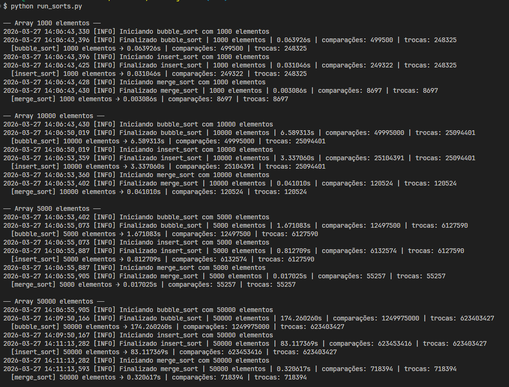
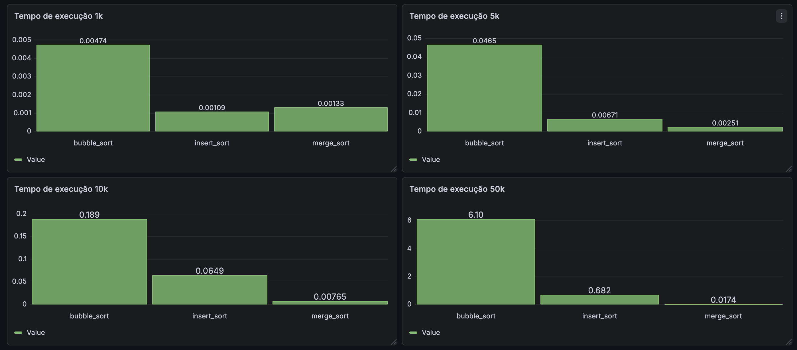
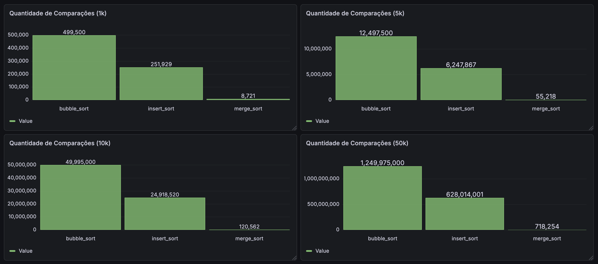
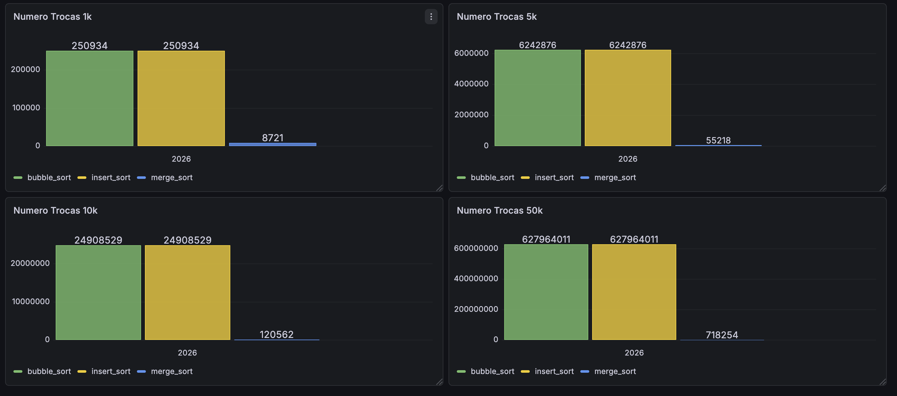

# Relatório Técnico — N1

## Implementação, Instrumentação e Análise de Algoritmos de Ordenação

**Aluno:** Lucas Affonso Klemke
**Disciplina:** Algoritmos Avançados
**Data:** 30/03/2026

---

## 1. Introdução

Este relatório documenta a implementação de três algoritmos de ordenação, sua instrumentação com OpenTelemetry e Prometheus, a visualização dos dados no Grafana e a análise crítica dos resultados obtidos a partir de execuções reais com arrays de diferentes tamanhos.

O objetivo não foi apenas implementar os algoritmos, mas analisar a teoria de complexidade com o comportamento real medido, utilizando ferramentas de observabilidade.

---

## 2. Algoritmos Implementados

### 2.1 Bubble Sort — O(n²)

Compara elementos adjacentes dois a dois e os troca se estiverem fora de ordem. Repete o processo até o array estar ordenado. A cada passagem, o maior elemento vai para o final.

- **Estável:** Sim
- **In-place:** Sim

### 2.2 Insertion Sort — O(n²)

Constrói o array ordenado um elemento por vez. Pega o elemento atual e o insere na posição correta dentro da parte já ordenada, deslocando os elementos maiores para a direita.

- **Estável:** Sim
- **In-place:** Sim

### 2.3 Merge Sort — O(n log n)

Divide o array ao meio recursivamente até restar elementos individuais, depois une os pares de forma ordenada no caminho de volta da recursão.

- **Estável:** Sim
- **In-place:** Não (usa memória extra)

---

## 3. Geração e Padronização dos Dados

Os arrays foram gerados uma única vez com o script `generator_array_csv.js`, salvos em arquivos CSV na pasta `data_arrays/`, e reutilizados por todos os algoritmos em cada execução.

| Arquivo | Tamanho |
| --- | --- |
| array_1000.csv | 1.000 elementos |
| array_5000.csv | 5.000 elementos |
| array_10000.csv | 10.000 elementos |
| array_50000.csv | 50.000 elementos |

Usar os mesmos arrays para todos os algoritmos é essencial para garantir validade experimental: se cada algoritmo recebesse dados diferentes, qualquer diferença de tempo poderia ser explicada pela distribuição dos dados, não pela complexidade do algoritmo.

---

## 4. Instrumentação com OpenTelemetry

A instrumentação foi feita no arquivo `run_sorts.js` utilizando:

- **OpenTelemetry SDK** — para traces e spans
- **prom-client** — para exposição de métricas (Node.js)

### Métricas coletadas

| Métrica | Descrição |
| --- | --- |
| `sort_execution_time_seconds` | Tempo de execução em segundos |
| `sort_comparacoes_total` | Número de comparações realizadas |
| `sort_trocas_total` | Número de trocas realizadas |

### Logs registrados

- Início de cada execução com algoritmo e tamanho do array
- Fim da execução com tempo, comparações e trocas
- Erros e exceções com stack trace

[](images/logs/log_code.png)

### Atributos dos spans

Cada span registra: `algorithm`, `input.size`, `execution_time_s`, `comparacoes`, `trocas`.

---

## 5. Ferramenta de Observabilidade

### Escolha: Grafana + Prometheus

**Por que Grafana?**

- Integração nativa com Prometheus
- Interface visual intuitiva para criação de dashboards
- Amplamente utilizado em ambientes profissionais de engenharia de software

**Por que Prometheus?**

- Coleta métricas via scrape HTTP — compatível com o `prom-client` do Node.js
- Modelo de dados orientado a séries temporais com suporte a labels, permitindo filtrar por algoritmo e tamanho de array

### Configuração

A stack foi configurada via Docker Compose com três serviços:

- **OTel Collector** — recebe traces via OTLP HTTP (porta 4318)
- **Prometheus** — coleta métricas do script Node.js (porta 8000) a cada 5 segundos
- **Grafana** — conectado ao Prometheus, exposto na porta 3000

---

## 6. Experimentos e Resultados

Todos os algoritmos foram executados sobre os mesmos arrays, nos mesmos tamanhos, na mesma ordem.

### 6.1 Array 1.000 elementos

| Algoritmo | Tempo | Comparações | Trocas |
| --- | --- | --- | --- |
| Bubble Sort | 0,004743s | 499.500 | 250.934 |
| Insert Sort | 0,001088s | 251.929 | 250.934 |
| Merge Sort | 0,001325s | 8.721 | 8.721 |

---

### 6.2 Array 5.000 elementos

| Algoritmo | Tempo | Comparações | Trocas |
| --- | --- | --- | --- |
| Bubble Sort | 0,046539s | 12.497.500 | 6.242.876 |
| Insert Sort | 0,006710s | 6.247.867 | 6.242.876 |
| Merge Sort | 0,002512s | 55.218 | 55.218 |

---

### 6.3 Array 10.000 elementos

| Algoritmo | Tempo | Comparações | Trocas |
| --- | --- | --- | --- |
| Bubble Sort | 0,188522s | 49.995.000 | 24.908.529 |
| Insert Sort | 0,064909s | 24.918.520 | 24.908.529 |
| Merge Sort | 0,007646s | 120.562 | 120.562 |

---

### 6.4 Array 50.000 elementos

| Algoritmo | Tempo | Comparações | Trocas |
| --- | --- | --- | --- |
| Bubble Sort | 6,099354s | 1.249.975.000 | 627.964.011 |
| Insert Sort | 0,682302s | 628.014.001 | 627.964.011 |
| Merge Sort | 0,017359s | 718.254 | 718.254 |

---

### 6.5 Visualização no Grafana

**Tempo de execução por algoritmo**

[](images/grafana/execucao.png)

**Quantidade de comparações**

[](images/grafana/comparacoes.png)

**Número de trocas**

[](images/grafana/trocas.png)

---

## 7. Análise Crítica

**Tabela Comparativa — Tempo de Execução por Algoritmo (segundos)**

| N | Bubble Sort | Insertion Sort | Merge Sort |
| --- | --- | --- | --- |
| 1.000 | 0,004743s | 0,001088s | 0,001325s |
| 5.000 | 0,046539s | 0,006710s | 0,002512s |
| 10.000 | 0,188522s | 0,064909s | 0,007646s |
| 50.000 | 6,099354s | 0,682302s | 0,017359s |

### Os resultados confirmaram a teoria?

Sim, em grande parte. O Merge Sort se manteve consistentemente mais rápido em todos os tamanhos, confirmando sua complexidade O(n log n). O Bubble Sort e o Insertion Sort cresceram de forma quadrática, conforme esperado pelo O(n²).

O dado mais evidente: ao passar de 1.000 para 50.000 elementos (50x mais dados), o Bubble Sort demorou ~1.285x mais. O crescimento teórico esperado por O(n²) seria 50² = 2.500x — a diferença frente ao teórico se deve ao overhead constante que tem peso proporcionalmente maior em arrays pequenos, fazendo o array de 1.000 elementos rodar relativamente mais rápido do que o modelo assintótico prevê.

### Onde a teoria não explica totalmente o comportamento real?

O Insertion Sort, apesar de ter a mesma complexidade O(n²) que o Bubble Sort, foi consistentemente entre 3x e 9x mais rápido em JavaScript. A teoria trata os dois como equivalentes, mas na prática o Insertion Sort faz menos trabalho: ele para de comparar assim que encontra o lugar certo, enquanto o Bubble Sort sempre percorre o array inteiro.

Isso se confirma nos dados de comparações: com 10.000 elementos, o Bubble Sort fez 49,9 milhões de comparações contra 25,1 milhões do Insertion Sort.

### Quando um algoritmo teoricamente pior teve desempenho aceitável?

Para arrays de 1.000 elementos, o Bubble Sort executou em apenas 0,063 segundos — tempo imperceptível para o usuário. Para entradas pequenas, a constante escondida no Big-O não importa, e algoritmos simples como Bubble Sort ou Insertion Sort são perfeitamente aceitáveis.

### Que fatores além do Big-O influenciaram os resultados?

- **Localidade de cache:** o Insertion Sort acessa memória de forma mais sequencial que o Bubble Sort, aproveitando melhor o cache do processador
- **Número real de operações:** o Big-O ignora constantes, mas na prática o Bubble Sort faz o dobro de comparações que o Insertion Sort para os mesmos dados
- **Overhead do JavaScript:** a implementação do Merge Sort utiliza índices (`i++`, `k++`) ao invés de `pop(0)`, evitando cópias desnecessárias de array — isso contribui para o desempenho consistente do Merge Sort mesmo nos maiores inputs

### O que você não teria percebido sem observabilidade?

Sem o Grafana e as métricas de comparações e trocas, seria impossível perceber que o Bubble Sort e o Insertion Sort realizam exatamente o mesmo número de trocas. Isso revela que ambos movem os elementos a mesma quantidade de vezes — a diferença de velocidade vem das comparações extras que o Bubble Sort faz, não das trocas.

Também não seria visível que o Merge Sort, apesar de muito mais rápido, faz o mesmo número de comparações e trocas — confirmando que sua eficiência vem da divisão recursiva, não de operar com menos dados.

---

## 8. Uso de IA

Claude Code foi utilizado como ferramenta de apoio ao longo de todo o projeto.

**Onde ajudou:**

- Configuração da stack Docker com Grafana, Prometheus e OTel Collector
- Implementação da instrumentação com `prom-client` após falhas no exporter OTLP
- Adição dos contadores de comparações e trocas nos algoritmos
- Estruturação/Refinação de Documentação
- Estruturação de passos do projeto
- Entender funcionamenot Grafana/Prometheus

**Onde foi necessário corrigir ou decidir sozinho:**

- A IA sugeriu inicialmente o `OTLPMetricExporter` para enviar métricas, mas ele não funcionou no ambiente com Docker — foi necessário trocar para o `prom-client` com endpoint HTTP direto
- A estrutura de pastas foi uma decisão própria, não sugerida pela IA
- A escolha de quais métricas eram relevantes para o relatório partiu da leitura crítica dos dados, não da IA
- Os algoritmos de ordenação foram desenvolvidos sem auxílio da IA
- Criação de gráficos e visualizações dentro do Grafana


**Onde a IA foi superficial:**

- Na configuração inicial do ambiente Docker, a IA sugeriu uma estrutura básica que precisou ser adaptada
- Durante a integração do OTel Collector, surgiram erros de conexão que a IA não conseguiu diagnosticar de forma precisa
- As métricas não estavam sendo exportadas corretamente para o Prometheus, exigindo depuração manual
- Na criação de dashboards no Grafana, a IA forneceu orientações genéricas que não se adequavam ao contexto específico do projeto
- A definição de quais métricas coletar (comparações, trocas, tempo de execução) foi uma decisão tomada após análise própria dos dados disponíveis

---

## 9. Conclusão

Este projeto evidenciou que fundamentos teóricos e aplicação prática de algoritmos se complementam, porém não são idênticos. A notação Big-O representa um instrumento valioso para estimar comportamento assintótico, contudo mascara fatores constantes, estratégias de acesso à memória e particularidades de implementação que somente se revelam através de medições concretas.

As ferramentas OpenTelemetry, Prometheus e Grafana possibilitaram análises detalhadas e objetivas acerca do desempenho e comparação entre os algoritmos considerando as entradas de dados fornecidas.

---

## 10. Como Executar o Projeto

### Estrutura do projeto

```
sort-algorithm/
├── data_arrays/                  # Arrays gerados em CSV
│   ├── array_1000.csv
│   ├── array_5000.csv
│   ├── array_10000.csv
│   └── array_50000.csv
├── grafana/
│   └── provisioning/
│       └── datasources/
│           └── prometheus.yml    # Datasource provisionado automaticamente
├── sorts/
│   ├── bubble_sort/
│   │   ├── bubble_sort.js
│   │   └── bubble_sort.md
│   ├── insert_sort/
│   │   ├── insert_sort.js
│   │   └── insert_sort.md
│   └── merge_sort/
│       ├── merge_sort.js
│       └── merge_sort.md
├── generator_array_csv.js        # Gerador de arrays aleatórios
├── run_sorts.js                  # Runner principal com instrumentação
├── package.json                  # Dependências Node.js
├── docker-compose.yml            # Stack de observabilidade
├── otel-collector-config.yml     # Configuração do OTel Collector
└── prometheus.yml                # Configuração do Prometheus
```

### Pré-requisitos

- Node.js 18+
- Docker Desktop

### Instalação

```bash
npm install
```

### Gerar os arrays de teste

```bash
npm run generate
```

Os arquivos são salvos em `data_arrays/` com o padrão `array_{tamanho}.csv`.
Para personalizar os tamanhos, edite a lista `sizes` no arquivo `generator_array_csv.js`.

### Executar os algoritmos

**1. Suba a stack de observabilidade**

```bash
docker compose up -d
```

**2. Execute o runner**

```bash
npm start
```

O script lê automaticamente todos os arrays em `data_arrays/`, executa os três algoritmos para cada tamanho e mantém o servidor de métricas no ar para o Prometheus coletar.

> ⚠️ Não feche o terminal enquanto quiser visualizar os dados no Grafana.

### Acessando a observabilidade

| Ferramenta | URL | Descrição |
|---|---|---|
| Métricas (raw) | http://localhost:8000/metrics | Endpoint Prometheus do script |
| Prometheus | http://localhost:9090 | Consultas e visualização raw |
| Grafana | http://localhost:3000 | Dashboards (login: admin / admin) |

O Grafana já sobe com o Prometheus configurado como datasource padrão — não é necessária nenhuma configuração manual.

**Queries úteis no Prometheus**

```promql
# Tempo de execução por algoritmo e tamanho
sort_execution_time_seconds_sum

# Filtrar por tamanho específico
sort_execution_time_seconds_sum{input_size="10000"}

# Filtrar por algoritmo
sort_execution_time_seconds_sum{algorithm="merge_sort"}
```

### Parar a stack

```bash
docker compose down
```